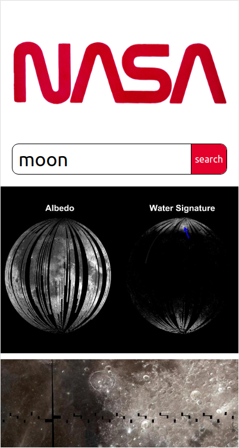

# React Technical Test

A react technical test to create a search engine that requests data from NASA's image API and displays it using react.

Completed as part of the Manchester Codes fast-track bootcamp.

App built in React, tested with Jest and React-Testing-Library.

## [Live Preview](https://perrybaran.github.io/react-tech-test/)

## Dependencies

1. [react](https://reactjs.org/)
2. [axios](https://www.npmjs.com/package/axios)
3. [prop-types](https://www.npmjs.com/package/prop-types)

### Dev Dependencies

1. [prettier](https://prettier.io/)
2. [gh-pages](https://www.npmjs.com/package/gh-pages)

## Setup

### `npm i`

Install all dependencies.

## Available Scripts

In the project directory, you can run:

### `npm start`

Runs the app in the development mode.\
Open [http://localhost:3000](http://localhost:3000) to view it in your browser.

The page will reload when you make changes.

### `npm test`

Launches the test runner in the interactive watch mode.

### `npm run build`

Builds the app for production to the `build` folder.\
It correctly bundles React in production mode and optimizes the build for the best performance.

### `npm run prettier`

Runs prettier on all files to format code.

### `npm run pre-deploy`

helps to bundle the react app. \
This command is run automatically when running deploy.

### `npm run deploy`

Generates a production build of the app and deploys it to GitHub pages.

## What I would add if I had more time

- Add proper error handling on API requests
- Add ability to zoom in on chosen image
- Add animations to image load

## Attribution

Created by **Perry Baran**
